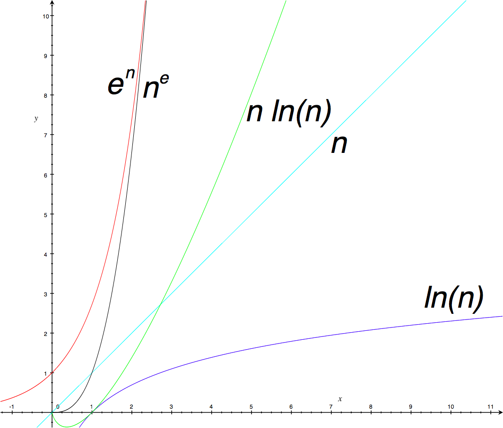

# 46. Conoce tus límites

Autor: Greg Colvin

> “Man’s got to know his limitations.” — [Dirty Harry](http://www.youtube.com/watch?v=t2JnCXvm_Qc))

Tus recursos son limitados. Sólo tienes cierto tiempo y dinero para hacer tu trabajo, incluyendo el tiempo y dinero necesario para mantener al día tus conocimiento, habilidades y herramientas. Sólo se puede trabajar duro, rápido e inteligentemente por cierto tiempo. Tus herramientas son poderosas. Tus máquinas destino son poderosas. Tienes que respetar los límites de tus recursos.

¿Cómo respetar estos límites? Conócete a ti mismo, conoce a tu gente, tu presupuesto y tus cosas. Especialmente, como ingeniero de software, conoce el espacio y tiempo de la complejidad de tus estructuras de datos y algoritmos, así como las características y rendimiento de tus sistemas. Tu trabajo es crear el enlace óptimo de software y sistemas.

La complejidad del espacio y tiempo están dadas como la función O(f(n)) donde n es igual al tamaño de las entradas en el espacio asintótico o el tiempo requerido conforme n incrementa hacia infinito. Las clases de complejidad importantes para f(n) incluyen ln(n), n, n ln(n), ne y en. Al graficar estas funciones se muestra claramente cómo conforme n se incrementa, O(ln(n)) es siempre mucho más pequeña que O(n) y O(n ln(n)), las cuales son cada vez más pequeñas que O(ne) y O(en). Como decía Sean Parent, para lograr n todas las clases de complejidad se acumulan casi constantemente, casi lineal o casi al infinito.

El análisis de complejidad está en términos de una máquina abstracta, pero el software se ejecuta en máquinas reales. Las sistemas modernos de computadoras están organizados como jerarquías de máquinas físicas y virtuales, incluyendo lenguajes en tiempo de ejecución, sistemas operativos, CPU, memoria caché, memoria de acceso aleatorio, manejadores de disco y redes. La primera tabla muestra los límites en el tiempo de acceso aleatorio y la capacidad de almacenamiento para un servidor en red típico.

|              | Tiempo de Acceso |  Capacidad |
|--------------|-----------------:| ----------:|
|register      |  < 1 ms          |        64b |
|cache line    |                  |        64B |
|L1 cache      |  1 ms            | 64 KB      |
|L2 cache      |  4 ns            | 8 MB       |
| RAM          | 20 ns            | 32 GB      |
| disk         | 10 ms            | 10 TB      |
| LAN          | 20 ms            | > 1 PB     |
| internet     | 100 ms           | > 1 ZB     |

Toma en cuenta que la capacidad y velocidad difiere en varios órdenes de magnitud. El almacenamiento en caché y el lookahead son usados ampliamente en cada nivel de nuestro sistema para ocultar esta variación, pero sólo funcionan cuando el acceso es predecible. Cuando el caché falla es frecuente que el sistema esté arrastrándose. Por ejemplo, inspeccionar aleatoriamente cada byte en un disco duro podría tomar hasta 32 años. Incluso inspeccionar aleatoriamente cada byte en la RAM podría tomar 11 minutos. El acceso aleatorio no es predecible. ¿Qué lo es? Eso depende del sistema, pero volver a acceder a elementos recientemente usados y acceder a elementos secuencialmente suele ser una victoria.

Los algoritmos y las estructuras de datos varían en qué tan efectivamente usan el caché. Por ejemplo:

- La búsqueda lineal hace buen uso del lookahead, pero requiere O(n) comparaciones.
- La búsqueda binaria de una matriz ordenada requiere sólo O(log(n)) comparaciones.
- La búsqueda en un árbol van Emde Boas es O(log(n)) y es ajeno al caché.

¿Cuál elegir? Como en el pasado análisis, midiéndolo. La segunda tabla muestra el tiempo requerido para buscar en matrices de enteros de 64 bits vía estos tres métodos. En mi computadora:

- La búsqueda lineal es competitiva para matrices pequeñas, pero pierde exponencialmente para matrices grandes
- van Emde Boas gana sin usar las manos, gracias a su patrones de acceso predecible.

|Elementos| lineal  | binario |   vEB   |
|:--------|--------:|--------:|--------:|
| 8       | 50      | 90      | 40      |
| 64      | 180     | 150     | 70      |
| 512     | 1200    | 230     | 100     |
| 4096    | 17000   | 320     | 160     |

“Pagas tu dinero y te llevas tu elección”. — [Punch](http://www.nytimes.com/1988/02/28/magazine/on-language-you-pays-yer-money.html?pagewanted=all)

Traducción: Espartaco Palma
